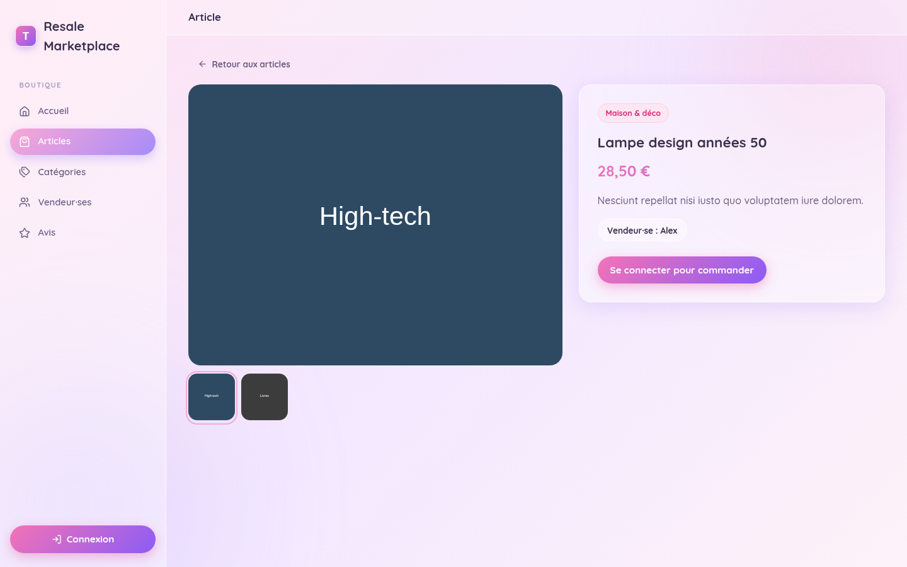
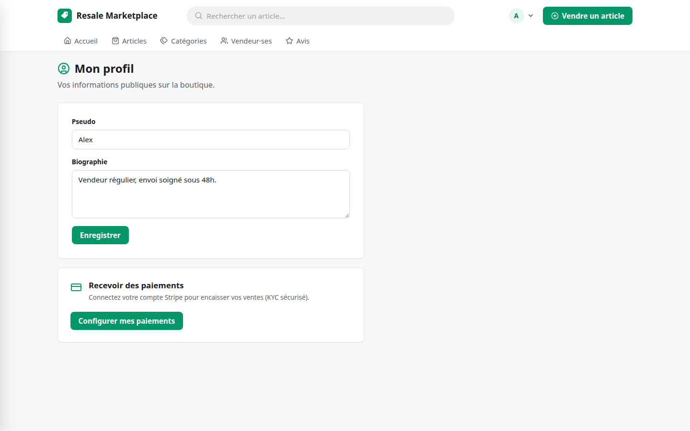

# Resale Marketplace — Symfony 8.1 (JSON API) + React 19 (SPA)


A peer-to-peer resale marketplace, ready to deploy out of the box: **Symfony 8.1 / PHP 8.5** as a JSON API (`/api/*`), **React 19 SPA** (clean, product-first marketplace UI) served by nginx, and **PostgreSQL 18**. The frontend lives in `frontend/` (Vite + TypeScript).

## Design

**“Marketplace clair”** — a light, product-first direction inspired by the UX of modern C2C marketplaces: a neutral, near-monochrome palette with a coherent emerald accent, system typography, bare product cards (photo / title / price) in dense responsive grids, a sticky marketplace header (logo, working search, account menu, secondary nav), a mobile bottom-nav and a sticky buy bar on item pages.

All visual decisions are centralized in design tokens (`frontend/src/styles/tokens.css`); component styles live in `frontend/src/styles/` (`base`, `layout`, `components`, `catalog`, `utils`).

> The UI is currently in French; the codebase (comments, naming) is in French too.






## Features

- **Authentication** — registration (buyer & seller), email confirmation, secure login (CSRF-protected JSON API), roles for admin / seller / buyer.
- **Public catalog** — items with photos, categories, seller pages, reviews, pagination and filtering.
- **Buyer space** — place orders, shipping addresses, order tracking (statuses), reviews after delivery.
- **Seller space** — publish and manage items, upload media, update order statuses (shipping, tracking).
- **Payments (Stripe Connect)** — seller KYC onboarding (Account Link v2, Accounts v2 recipient accounts), hosted Checkout Session with platform fee split, webhooks (`checkout.session.completed` → paid, `account.updated`, `charge.refunded`). Can be disabled in development by leaving `STRIPE_SECRET_KEY` empty.
- **Administration** — manage users and customer accounts.
- **Demo fixtures** — 6 categories, sellers, buyers, items and reviews (all demo accounts share the `demo1234` password).

## Tech stack

- PHP 8.5 (FPM) · Symfony 8.1 · PostgreSQL 18
- Nginx: React SPA (`frontend/dist`) + proxy of `/api/*` to PHP + static `/uploads/*`
- Frontend: React 19 + Vite 8 + strict TypeScript, React Router, TanStack Query, Vitest
- Mailpit (web UI: http://localhost:1181, SMTP: 1126)

## Prerequisites

- Docker & Docker Compose
- Make
- Node.js ≥ 20 (frontend build/dev — Node 24 recommended)

## Installation

```bash
cp .env.example .env   # then adjust if needed (ports, credentials, Stripe keys…)
make install
```

Builds the Docker images, installs the Composer **and** npm dependencies, builds the React SPA, then starts the containers. The `.env.example` defaults are enough to start in development (app on http://localhost:8081). **The SPA must be built (`make frontend-build`) for nginx to serve the application.**

## Available commands

| Command | Description |
|---|---|
| `make install` | Build, install (composer + frontend) and start everything |
| `make start` / `make stop` | Start / stop the containers |
| `make connect` | Shell into the PHP container |
| `make clear` | Clear the Symfony cache |
| `make composer-update` | Update the PHP dependencies |
| `make frontend-install` | Install the npm dependencies |
| `make frontend-build` | Build the SPA into `frontend/dist` |
| `make frontend-dev` | Vite dev server (HMR) on http://localhost:5173 |
| `make frontend-test` / `make frontend-lint` | Vitest / oxlint |

## URLs

| Service | URL |
|---|---|
| Application (SPA + API) | http://localhost:8081 |
| Vite dev (HMR, proxies `/api` → 8081) | http://localhost:5173 |
| Mailpit | http://localhost:1181 |
| PostgreSQL (host) | localhost:5532 |

## Development

### Backend (Symfony console)

```bash
make connect
php bin/console doctrine:migrations:migrate
php bin/console doctrine:fixtures:load --purge-with-truncate
```

### Frontend

```bash
make frontend-dev   # Vite on :5173, proxies /api and /uploads to :8081
```

### Fixtures & demo accounts

Fixtures: 6 categories, 3 sellers, 3 buyers + admin, items, orders, reviews, and royalty-free product photos (Pexels license, sources in `src/DataFixtures/medias/CREDITS.md`). The photos are copied into `public/uploads/` at load time. `--purge-with-truncate` empties the tables and resets the IDs.

Common password: `demo1234`

| Role | Email |
|---|---|
| Admin | `admin@example.test` |
| Sellers | `alex@example.test`, `sam@example.test`, `jordan@example.test` |
| Buyers | `camille@example.test`, `julien@example.test`, `sophie@example.test` |

### Tests & quality

```bash
php vendor/bin/phpunit                  # Backend: functional API tests (tests/Api/)
vendor/bin/phpstan analyse              # PHPStan level 6
vendor/bin/phpcs                        # PSR-12
make frontend-test                      # Frontend: Vitest (frontend/src/**/*.test.tsx)
make frontend-lint                      # oxlint
```

The **CI (GitHub Actions)** runs these checks on every push to `main` and on every pull request (`.github/workflows/ci.yml`).

## Architecture

- **JSON API**: `src/Controller/Api/*` — auth (json_login + CSRF header), public catalog, buyer space (orders, addresses, profile, reviews), seller space (items, media, Stripe onboarding), Stripe webhooks, admin (users, customers), public registration.
- **Payloads**: explicit mapping through `src/Service/CatalogPresenter` and `src/Service/OrderPresenter` (no reflective serialization — no `password`/Stripe account leaks in public reads).
- **Payments (Stripe Connect)**: one Connect account per seller created via the Accounts v2 API (recipient configuration — the platform is the merchant and transfers to sellers), KYC onboarding via hosted Account Link v2, Checkout Session with platform fee (`application_fee_amount`), webhooks (`checkout.session.completed` → paid, `account.updated`, `charge.refunded`). Inactive while `STRIPE_SECRET_KEY` is empty (development).
- **Business rules**: single-purchase (OneToOne Item↔Order), `availableCount` decremented on order, status transitions via `OrderStatus::allowedTransitions()`.
- **React SPA**: `frontend/src/` — `api/` (fetch client + CSRF + endpoints), `auth/` (AuthProvider, guards), `hooks/` (TanStack Query), `components/` (layout + UI kit + domain), `pages/` (catalog, buyer, seller, admin), `styles/` (design tokens + neutral marketplace styles).

## Environment variables

Defined in `.env`. Main ones:

| Variable | Default |
|---|---|
| `APP_PORT` | `8081` |
| `DATABASE_HOST` | `database` |
| `DATABASE_PORT` | `5432` |
| `DATABASE_NAME` | `resale-marketplace` |
| `MAILER_DSN` | `smtp://mailer:1025` |
| `STRIPE_SECRET_KEY` | *(empty — payments disabled)* |
| `STRIPE_WEBHOOK_SECRET` | *(empty)* |
| `PLATFORM_FEE_PERCENT` | `5` |
| `APP_BASE_URL` | `http://localhost:8081` |

For production payments: set `STRIPE_SECRET_KEY` / `STRIPE_WEBHOOK_SECRET`, point `APP_BASE_URL` to the real domain and register the Stripe webhook to `https://<domain>/api/webhooks/stripe`.

## Contributing

Contributions are welcome!

1. **Fork** the repository and create a dedicated branch (`git checkout -b feature/my-feature`).
2. **Conventions**: PHP PSR-12 (checked by PHPCS), PHPStan level 6, strict TypeScript on the frontend, comments and UI in French.
3. **Tests**: every change must pass the full suite:

   ```bash
   php vendor/bin/phpunit
   vendor/bin/phpstan analyse --memory-limit=1G
   vendor/bin/phpcs
   cd frontend && npm run build && npm test && npm run lint
   ```

4. Open a **pull request** to `main` with a clear description (problem, solution, tests run).

Bugs and feature requests are tracked via the [issues](https://github.com/lsoulier42/resale-marketplace/issues). For notable changes, add an entry to the [CHANGELOG](CHANGELOG.md).

## License

MIT — see [LICENSE](LICENSE).
